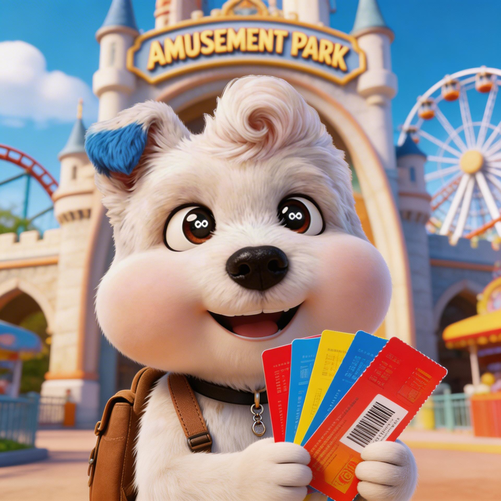

# Skill Card Generator

Automatically generate branded Skills Hub card images featuring a consistent IP mascot. Uses **image-to-image generation** — the reference image anchors the mascot's appearance while the prompt controls expression, outfit, and background, ensuring visual consistency across every card.

---

## IP Reference Image

> All generated cards use this image as the visual base. The mascot's appearance comes entirely from the reference — prompts only describe what changes.


---

## Three Generation Modes

### Mode 1 — Custom Scene (Single Card)

Describe any scene in natural language — English, Chinese, or mixed. The API generates a card from scratch based on your description.

**Terminal**
```bash
# English
python -m scripts.generate_card --custom "buying tickets at a theme park, excited expression, holding colorful tickets"

# Chinese
python -m scripts.generate_card --custom "小狗在图书馆看书，戴着圆框眼镜，温馨的暖光氛围"
```

**Agent code**
```python
from scripts.generate_card import generate_custom_card

path = generate_custom_card("buying tickets at a theme park, excited expression")
```

**Prompt writing guide**
- ✅ Describe: expression / emotion, clothing / props, background / setting, atmosphere / lighting
- ❌ Do not describe: the mascot's physical appearance (fur, body shape, face) — these come from the reference image

**Example output**

| Scene Description | Generated Card |
|------------------|---------------|
| Excited at theme park ticket booth, holding colorful tickets |  |
| Cozy library, round glasses, floating book pages, warm candlelight |  |

---

### Mode 2 — Variations (Multiple Versions of the Same Scene)

The same prompt produces a different composition, lighting, and angle on each API call. Use this mode to generate several options and pick the best one.

**Terminal**
```bash
python -m scripts.generate_card --variations 3 "sitting in a cozy library reading a book, wearing round glasses"
```

**Agent code**
```python
from scripts.generate_card import generate_custom_card_variations

paths = generate_custom_card_variations(
    "sitting in a cozy library reading a book, wearing round glasses",
    num_variations=3
)
# Returns: ["…_v1_….png", "…_v2_….png", "…_v3_….png"]
```

> **Cost note:** Each image ≈ ¥0.22 — 3 variations = ¥0.66, 5 variations = ¥1.10

**Example — same prompt, two different results**

| Variation 1 | Variation 2 |
|-------------|-------------|
|  |  |

> Identical prompt, two API calls — naturally different compositions to choose from.

---

### Mode 3 — Batch Generation (Different Scenes)

Generate multiple cards with different scene descriptions in a single call.

**Agent code**
```python
from scripts.generate_card import generate_custom_cards_batch

paths = generate_custom_cards_batch([
    "buying tickets at attraction entrance, excited expression",
    "booking hotel at front desk, happy and satisfied",
    "renting a car, confident ready-to-go expression",
])
# Returns: [path1, path2, path3] — same order as input, failed items skipped automatically
```

**Terminal**
```bash
python -m scripts.generate_card --custom-batch \
  "buying tickets, excited expression" \
  "working in a cafe, focused" \
  "surfing at the beach, thrilled"
```

---

## Which Mode to Use

| What you need | Use |
|---------------|-----|
| One card for a specific custom scene | `generate_custom_card(scene)` |
| Multiple options of the same scene to choose from | `generate_custom_card_variations(scene, num_variations=N)` |
| Multiple different scenes, one card each | `generate_custom_cards_batch([scene1, scene2, …])` |

---

## Quick Start

```bash
# 1. Install dependencies
pip install requests pillow python-dotenv

# 2. Set up environment variables
cp .env.example .env
# Edit .env and fill in DOUBAO_API_KEY

# 3. Confirm the reference image is in place
ls assets/ip-reference.png

# 4. Generate your first card
python -m scripts.generate_card --custom "buying tickets at a theme park, excited expression"
```

Output is saved to: `output/cards/`

---

## File Structure

```
skill-card-generator/
├── README.md
├── HOW_TO_RUN.md           # Detailed setup and usage guide
├── SKILL.md                # Agent integration spec (with YAML frontmatter)
├── .env.example            # Environment variable template
├── scripts/
│   ├── generate_card.py    # Main entry point for Agent calls
│   └── prompt_builder.py   # Prompt assembly logic
├── assets/
│   ├── ip-reference.png    # Mascot reference image (required)
│   ├── skill-config.json   # Skill configurations (custom mode only)
│   └── prompt-template.txt
├── examples/               # Sample generated cards (tracked in git)
│   ├── example_custom_theme_park.png
│   ├── example_custom_library.png
│   ├── example_variation_v1.png
│   └── example_variation_v2.png
├── references/
│   └── api-guide.md        # Doubao API integration reference
└── output/
    └── cards/              # Runtime output directory (git-ignored)
```
